<div style="text-align: center; padding-top: 50px; font-family: 'Outfit', sans-serif;">

<h1>Instituto Tecnológico de Las Américas (ITLA)</h1>
<br><br>
<h2>Configuración y Verificación de VPN IPsec Site-to-Site entre Firewalls FortiGate</h2>
<p style="text-align: center; font-size: 1.2em; color: #555; margin: 1em 0;">Documentación Técnica Profesional — Práctica 5 (Semana 6)</p>
<br><br><br>
<div class="presentacion-card">
<strong>Estudiante:</strong> Alan Daniel Garcia Mendez<br>
<strong>Matrícula:</strong> 2025-1403<br>
<strong>Carrera:</strong> Seguridad Informática<br>
<strong>Asignatura:</strong> Seguridad de Redes (TSI-203)<br>
<strong>Docente:</strong> Jonathan Esteban Rondon Corniel<br>
<strong>Fecha de Entrega:</strong> 3 de julio de 2026<br>
<strong>Video de Exposición:</strong> <a href="https://youtu.be/PnpUsolDV4E">https://youtu.be/PnpUsolDV4E</a>

<div style="page-break-after: always; break-after: page; display: block; height: 1px; overflow: hidden;">

## Objetivo de la VPN

El objetivo principal de esta práctica es implementar y validar una conexión de red privada virtual de sitio a sitio (VPN IPsec Site-to-Site) utilizando firewalls FortiGate como pasarelas de seguridad perimetral (`F-Oeste` y `F-Este`). Este túnel lógico seguro permite la interconexión cifrada de dos redes locales distintas (`14.3.10.0/24` y `14.3.20.0/24`) a través de un tránsito público simulado por el router del proveedor de servicios de internet (`ISP`).

El diseño asegura la confidencialidad, integridad y autenticidad del tráfico interesante de extremo a extremo mediante el uso de protocolos criptográficos estándar (IPsec, IKEv1), implementando tanto políticas de firewall estrictas como enrutamiento optimizado sobre la interfaz del túnel. Toda la configuración de seguridad, direccionamiento y enrutamiento en los firewalls se administra de manera exclusiva mediante su interfaz gráfica web (GUI).

## Topología de Red y Direccionamiento IP

La topología simulada consta de un router central de tránsito público (`ISP`), dos firewalls FortiGate perimetrales (`F-Oeste` y `F-Este`), switches de distribución interna y equipos de pruebas virtuales (`VPCs`) en cada extremo de la LAN corporativa.

<div style="text-align: center; margin: 10px 0;">
  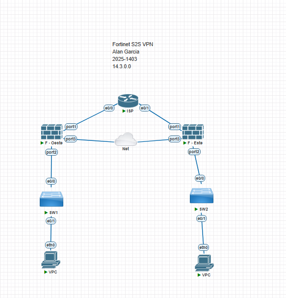
  <p style="font-size: 0.9em; color: #666; font-style: italic;">Esquema de topología de red física e interfaces implementado en GNS3</p>

El direccionamiento de la red está diseñado a partir de los parámetros de matrícula (`2025-1403`), distribuyendo las direcciones IP y subredes como se detalla en la siguiente tabla:

| Dispositivo / Rol | Interfaz | Dirección IP / Subred | Gateway | Descripción / Servicios Activos |
| :--- | :--- | :--- | :--- | :--- |
| **Router ISP (Tránsito)** | e0/0 | `1.1.1.1/30` | N/A | Enlace hacia FortiGate Oeste |
| | e0/1 | `2.2.2.1/30` | N/A | Enlace hacia FortiGate Este |
| **Firewall Oeste (F-Oeste)** | port1 (WAN) | `1.1.1.2/30` | `1.1.1.1` | Interfaz externa (Ping, HTTPS, SSH, HTTP, FMG-Access) |
| | port2 (LAN) | `14.3.10.1/24` | N/A | Gateway local (Ping) - Servidor DHCP Activo |
| | port3 (Net/Mgmt) | `192.168.211.201/24` | N/A | Interfaz de gestión física (Ping, HTTPS, SSH, HTTP) |
| **Firewall Este (F-Este)** | port1 (WAN) | `2.2.2.2/30` | `2.2.2.1` | Interfaz externa (Ping, HTTPS, SSH, HTTP, FMG-Access) |
| | port2 (LAN) | `14.3.20.1/24` | N/A | Gateway local (Ping) - Servidor DHCP Activo |
| | port3 (Net/Mgmt) | `192.168.211.203/24` | N/A | Interfaz de gestión física (Ping, HTTPS, SSH, HTTP) |
| **Cliente Oeste (VPC-Oeste)** | eth0 | `14.3.10.10/24` | `14.3.10.1` | Host local en la sucursal Oeste (Asignado por DHCP) |
| **Cliente Este (VPC-Este)** | eth0 | `14.3.20.10/24` | `14.3.20.1` | Host local en la sucursal Este (Asignado por DHCP) |

## Parámetros Criptográficos de la VPN

La configuración del túnel IPsec de sitio a sitio utiliza parámetros criptográficos definidos por el asistente de VPN en FortiGate:

| Parámetro del Túnel | Configuración de la Fase 1 (IKEv1) | Configuración de la Fase 2 (ESP) |
| :--- | :--- | :--- |
| **Protocolo / Versión** | IKEv1 (Main Mode / ID Protection) | IPsec (Encapsulating Security Payload - ESP) |
| **Algoritmo de Cifrado** | DES | DES / 3DES (Selección del Asistente) |
| **Algoritmo de Integridad/Hash** | MD5 y SHA1 | MD5 y SHA1 |
| **Grupo Diffie-Hellman (PFS)** | Grupo 14 (2048 bits) y Grupo 5 (1536 bits) | Grupo 14 y Grupo 5 |
| **Método de Autenticación** | Clave Pre-compartida (Pre-Shared Key) | N/A |
| **Valor de la Clave (PSK)** | `ITLAvpn2026` | N/A |
| **XAUTH / Ext. Auth** | Deshabilitado (Disabled) | N/A |
| **Selectores de Tráfico (Oeste)** | N/A | Local: `14.3.10.0/24`, Remoto: `14.3.20.0/24` |
| **Selectores de Tráfico (Este)** | N/A | Local: `14.3.20.0/24`, Remoto: `14.3.10.0/24` |

<div style="page-break-after: always; break-after: page; display: block; height: 1px; overflow: hidden;">

## Configuración del Enrutador ISP (Tránsito Público)

El router ISP proporciona conectividad WAN básica. No tiene conocimiento de las redes privadas (`14.3.10.0/24` y `14.3.20.0/24`), enrutando únicamente entre las redes directamente conectadas.

El archivo de configuración completo correspondiente se encuentra en: [config_isp.txt](resources/config_isp.txt).

```cisco
ISP# configure terminal
ISP(config)# interface Ethernet0/0
ISP(config-if)# description Enlace hacia FortiGate Oeste (F-Oeste port1)
ISP(config-if)# ip address 1.1.1.1 255.255.255.252
ISP(config-if)# no shutdown
ISP(config-if)# exit
ISP(config)# interface Ethernet0/1
ISP(config-if)# description Enlace hacia FortiGate Este (F-Este port1)
ISP(config-if)# ip address 2.2.2.1 255.255.255.252
ISP(config-if)# no shutdown
ISP(config-if)# exit
```

<div style="page-break-after: always; break-after: page; display: block; height: 1px; overflow: hidden;">

## Guía de Configuración Paso a Paso a través de la Interfaz Web (GUI)

Toda la administración del direccionamiento, políticas, enrutamiento y el túnel VPN en ambos firewalls FortiGate se realiza mediante la interfaz web gráfica. A continuación, se detalla el procedimiento de configuración paso a paso.

### 1. Configuración de Interfaces y Servidores DHCP

Antes de iniciar la creación del túnel, es necesario definir las direcciones IP en las interfaces físicas del firewall y configurar el direccionamiento LAN con su respectivo servidor DHCP local.

* **En FortiGate Oeste (F-Oeste):**
  1. Vaya a **Network** > **Interfaces**. Seleccione la lista física de interfaces.
  2. Edite `port1` (WAN):
     * *IP/Netmask:* `1.1.1.2/255.255.255.252`.
     * *Administrative Access:* Habilite **Ping**, **HTTPS**, **SSH**, **HTTP** y **FMG-Access**.
  3. Edite `port2` (renombrado a `LAN OESTE (port2)`):
     * *Alias:* `LAN OESTE`, *Role:* `LAN`.
     * *IP/Netmask:* `14.3.10.1/255.255.255.0`.
     * *Administrative Access:* Habilite únicamente **Ping**.
     * Habilite el interruptor **DHCP Server**:
       * *Address Range:* `14.3.10.10-14.3.10.254`.
       * *Default Gateway:* `Same as Interface IP`.
       * *DNS Server:* Seleccione **Specify** e introduzca el servidor de DNS `8.8.8.8`.
       * *Lease time:* `604800` segundos.
  4. La interfaz de gestión perimetral `port3` se define con la dirección `192.168.211.201/255.255.255.0` habilitando el acceso web HTTPS/HTTP y SSH para el control administrativo remoto.

<div style="text-align: center; margin: 10px 0;">
  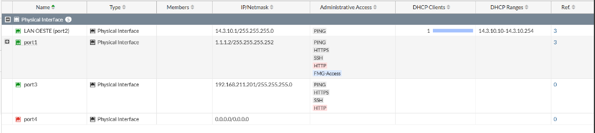
  <p style="font-size: 0.9em; color: #666; font-style: italic;">Estado de configuración de interfaces en la interfaz web de FortiGate Oeste</p>

<div style="text-align: center; margin: 10px 0;">
  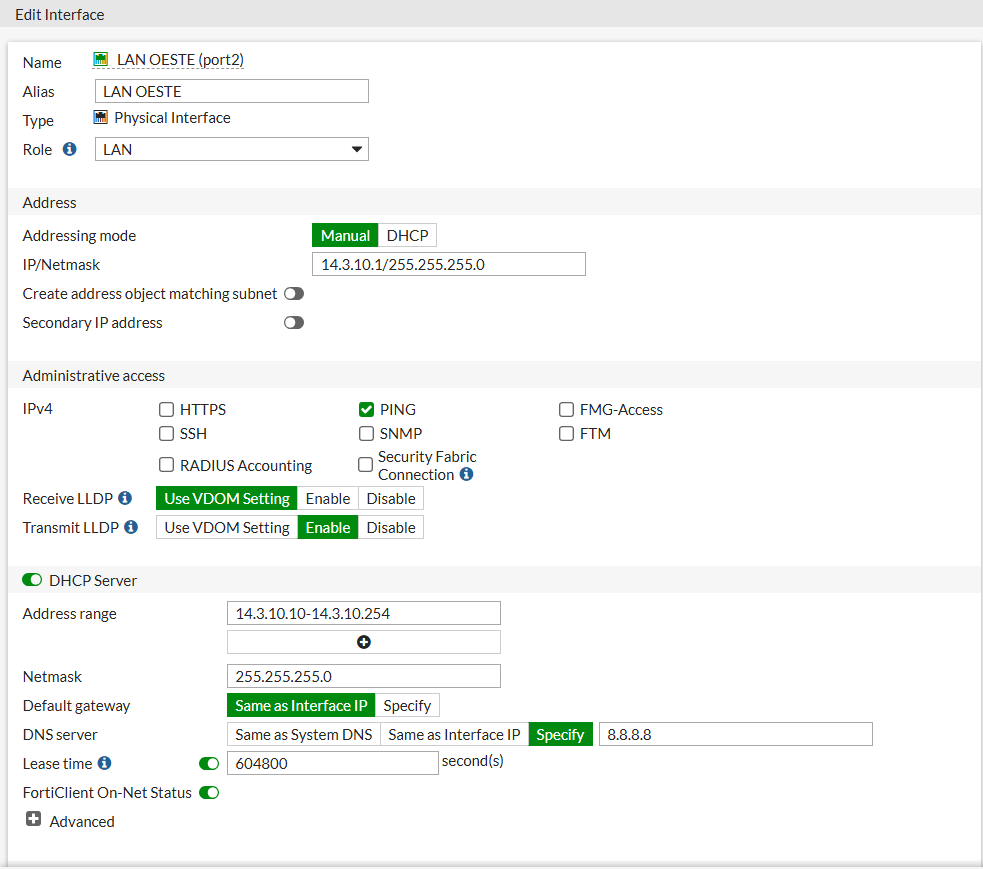
  <p style="font-size: 0.9em; color: #666; font-style: italic;">Configuración manual de direccionamiento y servidor DHCP en LAN Oeste</p>

<div style="page-break-after: always; break-after: page; display: block; height: 1px; overflow: hidden;">

* **En FortiGate Este (F-Este):**
  1. Vaya a **Network** > **Interfaces**. Seleccione la lista física de interfaces.
  2. Edite `port1` (WAN):
     * *IP/Netmask:* `2.2.2.2/255.255.255.252`.
     * *Administrative Access:* Habilite **Ping**, **HTTPS**, **SSH**, **HTTP** y **FMG-Access**.
  3. Edite `port2` (renombrado a `LAN ESTE (port2)`):
     * *Alias:* `LAN ESTE`, *Role:* `LAN`.
     * *IP/Netmask:* `14.3.20.1/255.255.255.0`.
     * *Administrative Access:* Habilite únicamente **Ping**.
     * Habilite el interruptor **DHCP Server**:
       * *Address Range:* `14.3.20.10-14.3.20.254`.
       * *Default Gateway:* `Same as Interface IP`.
       * *DNS Server:* Seleccione **Same as System DNS** para heredar la configuración DNS global del firewall.
       * *Lease time:* `604800` segundos.
  4. La interfaz de gestión perimetral `port3` se define con la dirección `192.168.211.203/255.255.255.0` habilitando el acceso web HTTPS/HTTP y SSH para el control administrativo remoto.

<div style="text-align: center; margin: 10px 0;">
  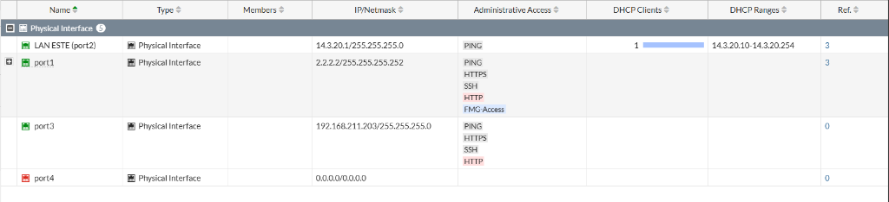
  <p style="font-size: 0.9em; color: #666; font-style: italic;">Estado de configuración de interfaces en la interfaz web de FortiGate Este</p>

<div style="text-align: center; margin: 10px 0;">
  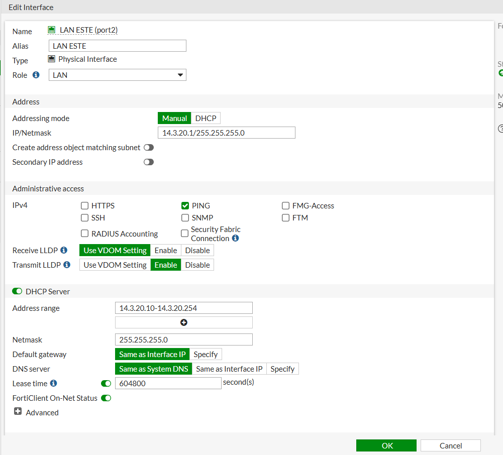
  <p style="font-size: 0.9em; color: #666; font-style: italic;">Configuración manual de direccionamiento y servidor DHCP en LAN Este</p>

<div style="page-break-after: always; break-after: page; display: block; height: 1px; overflow: hidden;">

### 2. Configuración del Enrutamiento y Rutas Estáticas

Para que el firewall reenvíe el tráfico saliente general e interconecte las subredes privadas a través del túnel VPN, se configuran las tablas de enrutamiento estático en **Network** > **Static Routes**.

* **En FortiGate Oeste (F-Oeste):**
  1. Ruta por defecto para internet:
     * *Destination:* `0.0.0.0/0`.
     * *Gateway IP:* `1.1.1.1`.
     * *Interface:* `port1`.
  2. Ruta hacia la subred remota (creada por el asistente):
     * *Destination:* Objeto `VPN-Oeste-Este_remote` (`14.3.20.0/24`).
     * *Interface:* Interfaz virtual del túnel `VPN-Oeste-Este`.
  3. Ruta de seguridad de tipo **Blackhole**:
     * *Destination:* Objeto `VPN-Oeste-Este_remote`.
     * *Interface:* `Blackhole`.
     * *Propósito:* Evitar que el tráfico destinado a la LAN remota se envíe en texto plano a través de internet en caso de que el túnel VPN se caiga.

<div style="text-align: center; margin: 10px 0;">
  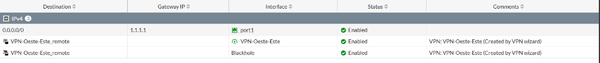
  <p style="font-size: 0.9em; color: #666; font-style: italic;">Tabla de rutas IPv4 configuradas en FortiGate Oeste</p>

* **En FortiGate Este (F-Este):**
  1. Ruta por defecto para internet:
     * *Destination:* `0.0.0.0/0`.
     * *Gateway IP:* `2.2.2.1`.
     * *Interface:* `port1`.
  2. Ruta hacia la subred remota Oeste (creada por el asistente):
     * *Destination:* Objeto `VPN-Este-Oeste_remote` (`14.3.10.0/24`).
     * *Interface:* Interfaz virtual del túnel `VPN-Este-Oeste`.
  3. Ruta de seguridad de tipo **Blackhole**:
     * *Destination:* Objeto `VPN-Este-Oeste_remote`.
     * *Interface:* `Blackhole`.

<div style="text-align: center; margin: 10px 0;">
  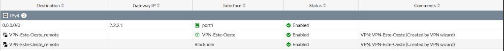
  <p style="font-size: 0.9em; color: #666; font-style: italic;">Tabla de rutas IPv4 configuradas en FortiGate Este</p>

<div style="page-break-after: always; break-after: page; display: block; height: 1px; overflow: hidden;">

### 3. Creación del Túnel VPN usando VPN Wizard

El asistente de VPN configura de manera transparente las fases de asociación de seguridad.

1. Navegue a **VPN** > **IPsec Tunnels** y presione **Create New** > **IPsec Tunnel**.
2. **Setup:** Ingrese el nombre (`VPN-Oeste-Este` en Oeste y `VPN-Este-Oeste` en Este), seleccione la plantilla **Site to Site** > **FortiGate**, NAT = **No NAT**. Presione **Next**.
3. **Authentication:** Ingrese la IP pública remota (`2.2.2.2` en Oeste, `1.1.1.2` en Este), seleccione la interfaz saliente `port1`, e ingrese la clave precompartida `ITLAvpn2026`.
4. **Policy & Routing:** Seleccione la interfaz LAN local (`port2`) y declare la subred remota del peer opuesto. Presione **Create**.

Al examinar la configuración detallada del túnel generado en **VPN** > **IPsec Tunnels** > **Edit**:
* **Network:** Remote Gateway apuntando a la IP pública remota sobre la interfaz de salida `port1`.
* **Authentication:** Clave precompartida definida, utilizando **IKE Versión 1** en **Main Mode** (ID Protection).
* **Fase 1:** Propuesta de cifrado/hash basada en algoritmos `DES-MD5` y `DES-SHA1` sobre grupos Diffie-Hellman **14** y **5**.
* **Phase 2 Selectors:** Direccionamiento de red mapeado con los objetos creados por el asistente (`VPN-Oeste-Este_local` ↔ `VPN-Oeste-Este_remote` en el Oeste, y `VPN-Este-Oeste_local` ↔ `VPN-Este-Oeste_remote` en el Este).

<div style="text-align: center; margin: 10px 0;">
  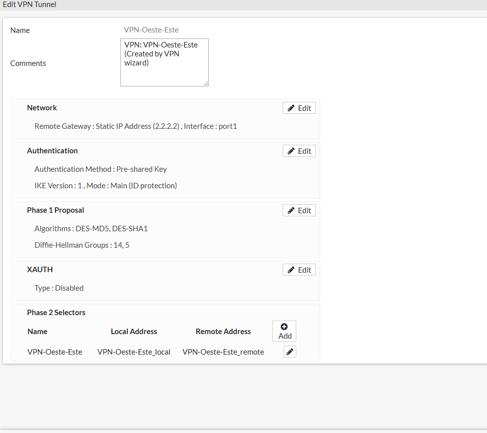
  <p style="font-size: 0.9em; color: #666; font-style: italic;">Detalles de la configuración del túnel IPsec en FortiGate Oeste</p>

<div style="text-align: center; margin: 10px 0;">
  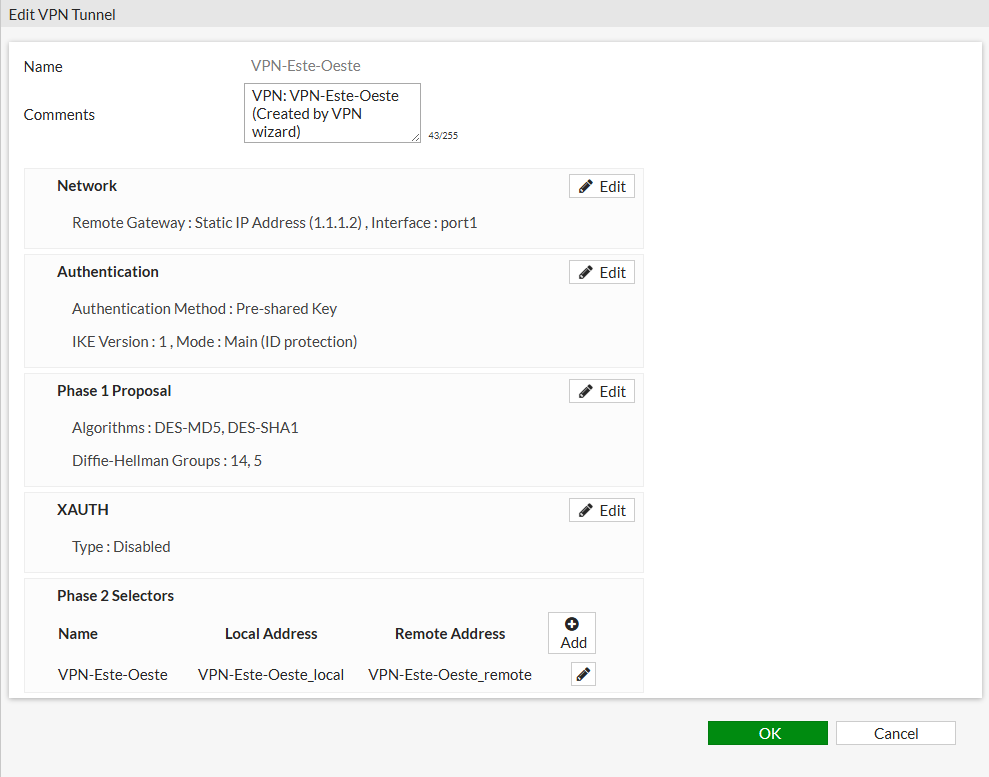
  <p style="font-size: 0.9em; color: #666; font-style: italic;">Detalles de la configuración del túnel IPsec en FortiGate Este</p>

<div style="page-break-after: always; break-after: page; display: block; height: 1px; overflow: hidden;">

## Verificación y Pruebas de Funcionamiento

Las pruebas de verificación permiten corroborar la correcta negociación del túnel y el tráfico de datos.

### 1. Monitoreo Gráfico (GUI) en FortiGate

1. En la consola de administración web de FortiGate, navegue hasta **Monitor** > **IPsec Monitor** (o vaya directamente a **VPN** > **IPsec Tunnels**).
2. Localice el túnel creado y confirme que el estado se muestra de color verde con la etiqueta **Up** en ambas fases (Fase 1 y Fase 2 Selectors).
3. El panel registrará el tráfico interesante entrante y saliente negociado a través de la conexión activa.

<div style="text-align: center; margin: 10px 0;">
  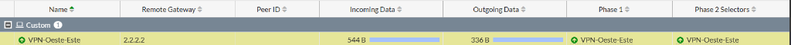
  <p style="font-size: 0.9em; color: #666; font-style: italic;">Estado activo (Up) del túnel y tráfico cursado en el IPsec Monitor de FortiGate Oeste</p>

<div style="text-align: center; margin: 10px 0;">
  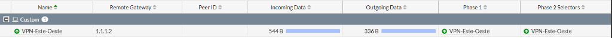
  <p style="font-size: 0.9em; color: #666; font-style: italic;">Estado activo (Up) del túnel y tráfico cursado en el IPsec Monitor de FortiGate Este</p>

<div style="page-break-after: always; break-after: page; display: block; height: 1px; overflow: hidden;">

### 2. Prueba de Conectividad y Trazado de Ruta (Ping & Traceroute)

Para validar la conectividad de extremo a extremo y comprobar el flujo del tráfico en la topología, se ejecuta una prueba de ping y un trazado de ruta (`traceroute`) desde el terminal del cliente local de pruebas `VPC-Oeste` hacia el host remoto en la sucursal de destino (`14.3.20.10`).

* **Prueba de Ping:**
  Al enviar paquetes ICMP, se comprueba que el enlace está establecido y la conectividad es exitosa, registrando tiempos de respuesta de baja latencia:
  ```text
  VPCS> ping 14.3.20.10
  84 bytes from 14.3.20.10 icmp_seq=1 ttl=62 time=1.294 ms
  84 bytes from 14.3.20.10 icmp_seq=2 ttl=62 time=1.624 ms
  84 bytes from 14.3.20.10 icmp_seq=3 ttl=62 time=1.282 ms
  84 bytes from 14.3.20.10 icmp_seq=4 ttl=62 time=1.467 ms
  84 bytes from 14.3.20.10 icmp_seq=5 ttl=62 time=1.442 ms
  ```

* **Trazado de Ruta (Traceroute):**
  Al trazar el camino que toman los paquetes, se verifica que el enrutamiento se realiza directamente a través del túnel VPN seguro:
  ```text
  VPCS> tracer 14.3.20.10
  trace to 14.3.20.10, 8 hops max, press Ctrl+C to stop
  1  14.3.10.1  0.451 ms  0.309 ms  0.271 ms   (Gateway local port2 de F-Oeste)
  2  2.2.2.2  0.710 ms  0.603 ms  0.484 ms     (IP pública del peer remoto F-Este / Interfaz del túnel)
  3  *14.3.20.10  0.939 ms (ICMP type:3, code:3, Destination port unreachable)
  ```
  *Análisis del Trazado:* El tráfico es enviado al gateway local (`14.3.10.1`) y, gracias a la ruta estática y a las políticas del firewall, es introducido directamente en el túnel IPsec, apareciendo en el extremo remoto (`2.2.2.2`) en el segundo salto sin pasar de forma visible por el enrutador intermedio `ISP` (`1.1.1.1` o `2.2.2.1`). El tercer salto alcanza el destino final (`14.3.20.10`).

<div style="text-align: center; margin: 10px 0;">
  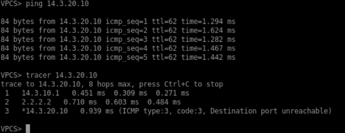
  <p style="font-size: 0.9em; color: #666; font-style: italic;">Evidencia de conectividad exitosa y trazado de ruta a través de la VPN IPsec</p>

> **Consejo de validación:** Debido a que las VPNs de FortiGate negocian e inician la conexión de forma automática al recibir tráfico interesante, el primer paquete del ping puede perderse momentáneamente durante la negociación ISAKMP/IPsec. Las siguientes solicitudes deben responder con total normalidad. El mensaje *Destination port unreachable* al final del traceroute en VPCS es el comportamiento normal de este host virtual al recibir la respuesta ICMP de finalización de ruta.
